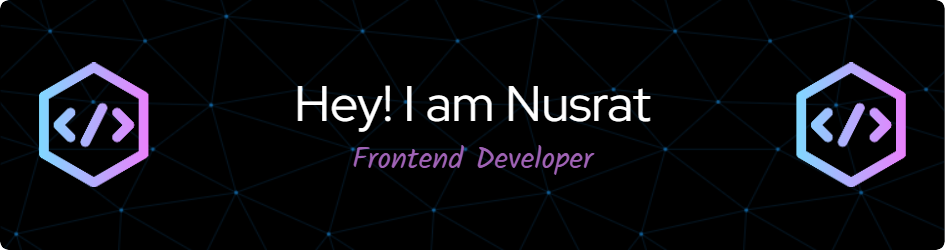

  

###

<h1 align="center">Hi     I'm Nusrat Jahan</h1>

###

<h4 align="center">A passionate Frontend Web Developer with a love for creating dynamic and user-friendly web applications. 🚀</h4>

###

<h2 align="center">About me    </h2>

###

I am an aspiring Web Developer with a Passion for Building Interactive User Experiences. Enthusiastic about developing responsive and user-friendly websites, with experience in HTML, CSS, and JavaScript and frameworks like React, Bootstrap. I bring a fresh perspective and am eager to contribute to innovative projects while expanding my skills in modern web development. 

###

✨ Creating bugs since 2024 💡 Exploring Next.js & modern web development 📚 On a quest for knowledge, one line of code at a time 🎵 Life’s better with music, movies, and great code

###

<h2 align="center">I code with    </h2>

###

  
  
  
  
  
  
  
  
  
  
  
  
  
  
  
  
  

###

<h2 align="center">Connect With Me   </h2>

###

  
  

###

  
  

###

  

###
